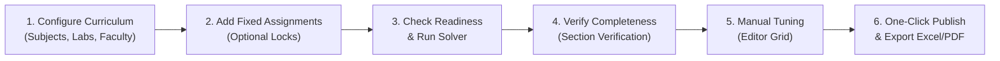

# Smart CSE Timetable Management System

An automated, constraint-driven timetable generation and management platform for Computer Science & Engineering departments. Powered by a deterministic Constraint Satisfaction Problem (CSP) solver, Google Firebase Cloud Firestore for real-time multi-user synchronization, and Dexie IndexedDB for robust offline capabilities.

---

## Key Features

- **CSP Timetable Generator**: Web Worker-backed solver that generates conflict-free schedules across multiple academic years and sections in seconds.
- **Firebase Cloud Persistence**: Globally shared cloud database with real-time `onSnapshot` updates across all connected browsers and staff.
- **Fixed Assignments Engine**: Lock specific theory subjects, lab blocks (continuous 3-period practical / 2-period integrated), or library hours into designated slots before dynamic generation.
- **Faculty Availability & Free Period Finder**: Interactive day and period selector showing free vs. teaching faculty with real-time workloads and instant substitute recommendations.
- **Morning/Afternoon Distribution**: Soft heuristic balancing subjects across the lunch break.
- **Non-Consecutive Teaching Protection**: Soft constraint avoiding 3+ consecutive periods for faculty members.
- **Comprehensive Verification Suite**: Section-level audits verifying exact subject period frequencies, lab continuity, library requirements, and department-wide completeness.
- **Interactive Drag-and-Drop Editor**: Visual schedule grid with locked-slot indicators, conflict validation, and manual override capabilities.
- **Multi-Format Exports**: One-click generation of Department Master Timetable, Section Timetables, and Faculty-Wise Timetables in styled Excel (`.xlsx`) and PDF formats.

---

## Step-by-Step Manual Setup Guide

Follow this guide step-by-step to set up, configure, populate, and deploy the system.

### Prerequisites

- **Node.js** (v18.0.0 or higher, v20+ recommended)
- **Git** installed on your system
- A free **Google Account** (for Firebase Console)
- A free **Vercel Account** (optional, for cloud hosting)

---

### Step 1: Clone the Repository & Install Dependencies

Open PowerShell, Terminal, or Command Prompt:

```bash
# Clone the repository
git clone https://github.com/muneeskumar007/cse-timetable.git

# Enter the project directory
cd cse-timetable

# Install all dependencies
npm install
```

---

### Step 2: Create a Firebase Project & Firestore Database

1. Open your browser and navigate to the [Firebase Console](https://console.firebase.google.com/).
2. Log in with your Google account.
3. Click **Add project** (or **Create a project**):
   - Project name: enter `cse-smart-timetable` (or your preferred name).
   - Google Analytics: You can uncheck "Enable Google Analytics" to speed up setup.
   - Click **Create project** and wait for it to finish.
4. In the left navigation sidebar, go to **Build** > **Firestore Database**.
5. Click **Create database**:
   - **Database ID**: Leave as `(default)`.
   - **Location**: Select your nearest region (e.g. `asia-south1 (Mumbai)` or `us-central`).
   - **Secure rules**: Choose **Start in test mode** for now.
   - Click **Create**.

---

### Step 3: Register a Web App in Firebase & Obtain API Keys

1. In the Firebase Console, click the **Settings gear icon** in the top left sidebar > select **Project settings**.
2. Scroll down to the **Your apps** section and click the **Web icon (`</>`)**.
3. **App nickname**: Enter `cse-timetable-web`.
4. Leave *Firebase Hosting* unchecked.
5. Click **Register app**.
6. Firebase will display your `firebaseConfig` object looking like this:

   ```javascript
   const firebaseConfig = {
     apiKey: "AIzaSyB1234567890abcdef...",
     authDomain: "cse-smart-timetable.firebaseapp.com",
     projectId: "cse-smart-timetable",
     storageBucket: "cse-smart-timetable.appspot.com",
     messagingSenderId: "123456789012",
     appId: "1:123456789012:web:abcdef123456...",
     measurementId: "G-ABCDEFGHIJ" // optional
   };
   ```
7. Keep this tab open or copy these values.

---

### Step 4: Configure Local Environment Variables

1. In the root directory of the project, create a new file named `.env.local` (or copy `.env.example`):

   ```powershell
   # In PowerShell:
   Copy-Item .env.example .env.local
   ```

2. Open `.env.local` in your editor and paste the credentials obtained in Step 3:

   ```ini
   VITE_FIREBASE_API_KEY=AIzaSyB1234567890abcdef...
   VITE_FIREBASE_AUTH_DOMAIN=cse-smart-timetable.firebaseapp.com
   VITE_FIREBASE_PROJECT_ID=cse-smart-timetable
   VITE_FIREBASE_STORAGE_BUCKET=cse-smart-timetable.appspot.com
   VITE_FIREBASE_MESSAGING_SENDER_ID=123456789012
   VITE_FIREBASE_APP_ID=1:123456789012:web:abcdef123456...
   VITE_FIREBASE_MEASUREMENT_ID=G-ABCDEFGHIJ
   ```

> [!NOTE]
> `.env.local` is ignored by Git, ensuring your private Firebase credentials are never leaked.

---

### Step 5: Deploy Firestore Security Rules

1. In the Firebase Console, navigate to **Firestore Database** in the left sidebar.
2. Click on the **Rules** tab at the top.
3. Replace the entire contents of the rules editor with the rules defined in `firestore.rules`:

   ```javascript
   rules_version = '2';
   service cloud.firestore {
     match /databases/{database}/documents {
       // Department Timetable Collections: Allow read and write access
       match /{collection}/{document=**} {
         allow read, write: if true;
       }
     }
   }
   ```

4. Click **Publish**.

---

### Step 6: Start the Local Development Server

Run the development server:

```bash
npm run dev
```

1. Open your browser to `http://localhost:5173`.
2. Inspect the **Cloud Status Pill** in the top navigation bar:
   - 🟢 **Cloud Connected**: Firebase credentials are valid and live connection is active.
   - 🟡 **Local / Demo Mode**: If credentials are unset or invalid, the app gracefully operates using Dexie browser storage without crashing.

---

### Step 7: Populate Initial Department Data

You can seed the system with demo data or enter real data:

#### Option A: One-Click Demo Data (Recommended for first test)
1. In the app sidebar, click **Backup / Restore**.
2. Click **Load Demo Data**.
3. The system will write standard CSE department records to Firebase Cloud Firestore:
   - 4 Academic Years & Sections (II CSE A/B, III CSE A/B, IV CSE A/B).
   - 15 Faculty members with target workloads.
   - Core Theory Subjects and teaching allocations.
   - Practical & Integrated Labs with assigned rooms.
   - Department bell schedule (Periods 1–7, Lunch break, Unit Test fixed slots).

#### Option B: Manual Data Entry or Excel Import
Use the sidebar pages to configure your department:
1. **Academic Years**: Define batches, years, and sections (e.g., Year 2 Section A).
2. **Faculty**: Add faculty names, codes, designations, and target weekly hours (or import via Excel).
3. **Subjects**: Add course codes, titles, weekly periods, and allocate faculty per section.
4. **Labs**: Configure labs as *Practical* (3 consecutive periods) or *Integrated* (2 periods).
5. **Classrooms & Labs**: Add room numbers and capacities.
6. **Settings**: Adjust working days (Mon–Sat), periods per day, and bell timings.

---

### Step 8: Configure Fixed Assignments (Optional)

If your department requires certain subjects, labs, or library hours locked to specific slots:

1. Click **Fixed Assignments** in the sidebar.
2. Click **Add Fixed Assignment**:
   - **Theory**: Pin a theory subject to a specific day and period (e.g. Wednesday Period 1).
   - **Lab**: Pin a 3-hour practical lab block (e.g. Tuesday Periods 2–4).
   - **Library**: Lock mandatory weekly library sessions.
3. Active fixed assignments will automatically be reserved and locked during generation, and will display a lock icon in the schedule grid.

---

### Step 9: Generate, Verify & Publish the Timetable

1. Click **Timetable Generator** in the sidebar.
2. Review the **Readiness Checklist**:
   - Ensure all green checkmarks appear for faculty allocations, room capacities, and lab assignments.
3. Click **Generate Timetable**:
   - The CSP engine solves all constraints in a background Web Worker.
4. Once generated, inspect the schedule:
   - Click **Section Verification**: Check the department summary table. Confirm all theory subject frequencies match required hours, lab blocks are continuous, and library requirements are satisfied.
   - Click **Faculty Availability**: Inspect free/busy faculty by day and period.
   - Click **Timetable Editor**: View the interactive grid. Adjust or swap slots if desired (locked slots are protected).
5. Click the green **Publish** button in the header:
   - This officially publishes the version. All users, students, and faculty viewing the web app will see the official live schedule.

---

### Step 10: Production Deployment to Vercel

To host the application online for your institution:

1. Push your latest code to your GitHub repository:
   ```bash
   git push origin main
   ```
2. Log in to [Vercel](https://vercel.com/) and click **Add New** > **Project**.
3. Select your `cse-timetable` GitHub repository and click **Import**.
4. In the configuration screen:
   - **Framework Preset**: Vite
   - **Build Command**: `tsc -b && vite build` (default)
   - **Output Directory**: `dist` (default)
5. Expand the **Environment Variables** section and add all 7 keys from your `.env.local` file:
   - `VITE_FIREBASE_API_KEY`
   - `VITE_FIREBASE_AUTH_DOMAIN`
   - `VITE_FIREBASE_PROJECT_ID`
   - `VITE_FIREBASE_STORAGE_BUCKET`
   - `VITE_FIREBASE_MESSAGING_SENDER_ID`
   - `VITE_FIREBASE_APP_ID`
   - `VITE_FIREBASE_MEASUREMENT_ID`
6. Click **Deploy**.
7. Vercel will build and provide a production URL (e.g. `https://cse-timetable.vercel.app`). Share this URL with department faculty and students!

---

## Daily / Semester Operator Workflow



1. **Before Semester**: Update faculty list, subject allocations, and semester working days.
2. **Fixed Slots**: Enter fixed labs (sharing hardware), library hours, or visiting professor slots.
3. **Generation**: Run the solver. Fix any warnings shown by the readiness check.
4. **Verification**: Confirm 100% of subject hours and lab blocks are allocated via **Section Verification**.
5. **Publish**: Click **Publish**. Download master and individual schedules via **Exports**.
6. **Mid-Semester Substitutions**: Use **Faculty Availability** to find free staff members for leave coverage.

---

## Project Structure

```
cse-timetable/
├── firestore.rules              # Firebase Cloud Firestore security rules
├── .env.example                 # Template for Firebase environment keys
├── src/
│   ├── components/
│   │   ├── common/              # Buttons, Cards, Modals, Badges
│   │   ├── layout/              # Sidebar, Header, Breadcrumbs, Navigation
│   │   └── timetable/           # Grid, Cell, Slot Card, Conflict Badges
│   ├── context/
│   │   └── DataContext.tsx      # Firestore onSnapshot real-time sync & provider
│   ├── db/
│   │   └── database.ts          # Dexie.js IndexedDB schema (v2 with fixedAssignments)
│   ├── lib/
│   │   └── firebase.ts          # Firebase SDK client initialization
│   ├── pages/
│   │   ├── Dashboard.tsx        # Overview cards, generation status, quick actions
│   │   ├── GeneratorPage.tsx    # Readiness checks & CSP engine runner
│   │   ├── EditorPage.tsx       # Drag-and-drop schedule grid & lock icons
│   │   ├── FixedAssignmentsPage.tsx # Theory, Lab, & Library locked slot manager
│   │   ├── FacultyAvailabilityPage.tsx # Free/Busy engine & substitute finder
│   │   ├── SectionVerificationPage.tsx # Completeness audit & subject frequency
│   │   ├── FacultyPage.tsx      # Faculty profiles & workload limits
│   │   ├── SubjectsPage.tsx     # Curriculum courses & faculty mapping
│   │   ├── LabsPage.tsx         # Practical (3-period) & Integrated (2-period) labs
│   │   ├── YearsPage.tsx        # Academic batches & sections
│   │   ├── RoomsPage.tsx        # Classroom & lab venues
│   │   ├── ExportsPage.tsx      # Excel (.xlsx) & PDF generation
│   │   ├── SettingsPage.tsx     # Bell schedule & working days
│   │   └── BackupPage.tsx       # JSON backup, restore & demo data loader
│   ├── services/
│   │   ├── cloudService.ts      # Batched Firestore CRUD & Dexie cache mirror
│   │   ├── verificationService.ts # Completeness & faculty availability logic
│   │   ├── excelService.ts      # Excel export & import parser
│   │   ├── pdfService.ts        # PDF document renderer
│   │   └── backupService.ts     # Complete state backup & restoration
│   ├── timetable/
│   │   ├── engine.ts            # CSP Solver with heuristics & fixed assignment locks
│   │   ├── validator.ts         # Constraint validation (hard conflicts & soft warnings)
│   │   ├── readiness.ts         # Pre-generation readiness checker
│   │   └── worker.ts            # Web Worker for non-blocking solving
│   ├── types/
│   │   └── index.ts             # Domain interfaces & TypeScript types
│   ├── test/                    # Vitest unit test suites
│   └── App.tsx                  # Main layout and route definitions
```

---

## Testing & Quality Assurance

Run the test suite:

```bash
# Run unit tests
npm test

# Run tests with coverage
npx vitest run --coverage

# Type-check TypeScript code
npx tsc -b

# Run production build
npm run build
```

---

## Tech Stack

- **Frontend**: React 19, TypeScript, Tailwind CSS, Lucide Icons, Vite
- **Cloud Database**: Google Cloud Firestore (Firebase Web SDK v12)
- **Local Cache**: Dexie.js (IndexedDB wrapper v4)
- **State Management**: Zustand & React Context
- **Scheduling Engine**: Custom Constraint Satisfaction Problem (CSP) Solver + Web Workers
- **Export Engines**: SheetJS (`xlsx`), jsPDF, jsPDF-autotable
- **Testing**: Vitest
